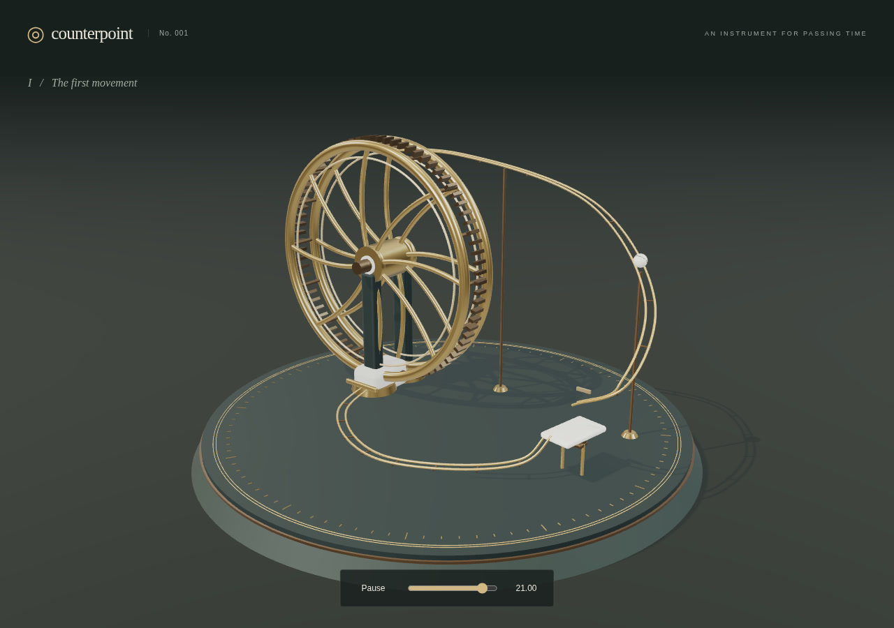

# Counterpoint

[Play Counterpoint](https://why-el.github.io/counterpoint/) · [Watch a minute](https://wael.khobalatte.com/counterpoint/counterpoint.webm)



A marble music box you can play and rewind. Balls roll down brass tracks and strike ceramic plates. Each strike plays a note when sound is on.

There are eight pitches and three repeating patterns, with rests between notes. The name comes from counterpoint: separate musical lines heard together. You don't need any music knowledge to play.

- Press **Sound** to listen.
- Drag the large wheel backward to rewind. Release to pause; turn forward to resume.
- Tap a white plate to turn its part on or off. Balls already moving finish their routes.
- Drag empty space to look around; scroll or pinch to zoom.

Notes and the time slider offer keyboard controls. Share copies a link to your arrangement.

## Run locally

Requires Node 22.12 or newer.

```sh
npm ci
npm run dev
```

`npm test` runs the core tests. `npm run build` creates the static site in `dist/`.

[Test results](REVIEW_LOG.md) · [Design notes](DECISIONS.md)
